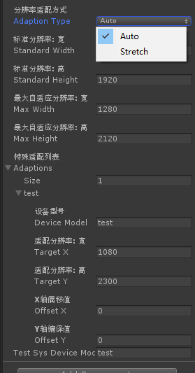
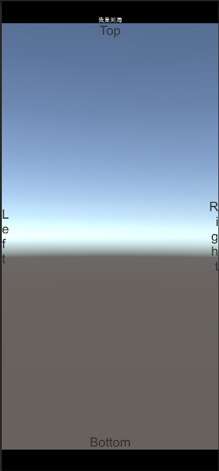

## Unity uGUI界面自适应, 在一定的范围内, 进行分辨率适配
### 1. 大部分机型都可以使用默认的方式进行适配
### 2. 特殊机型进行根据型号进行适配

## 在预制体上设置可能会出现不怎么方便, 可以使用外部访问接口, 在配置表中设置
例如我的配置表:

## 支持两种使用方式
### 1.排版自适应方式（排版要求高）
#### 例：
标准分辨率（同样是界面排版分辨率）：1920x1080
适配分辨率（大尺寸手机上最大显示的分辨率）：2020x1180, 这就意味着在不同的机型上看到的范围（0~100像素）是不同的
在这种情况下就要求：
##### 1.界面背景如果不拉伸的情况下 分辨率为 2020x1180
##### 2.界面排版，需要考虑适应后的情况，尽量使用uGui的锚点排版。例如列表的显示范围等
### 2.硬拉深自适应方式（方便，但会影响一定的界面美观，并有可能造成粒子特效错位）
标准分辨率（同样是界面排版分辨率）：1920x1080
适配分辨率（大尺寸手机上进行拉伸到的分辨率）：2020x1180, 这就意味着在不同的机型上会看到不同程度的拉伸变形
在这种情况下只要按照标准分辨率排版即可 不用考虑适配情况 但是需要注意粒子特效或模型等的拉伸情况

## 横向自适应

## 垂直自适应

